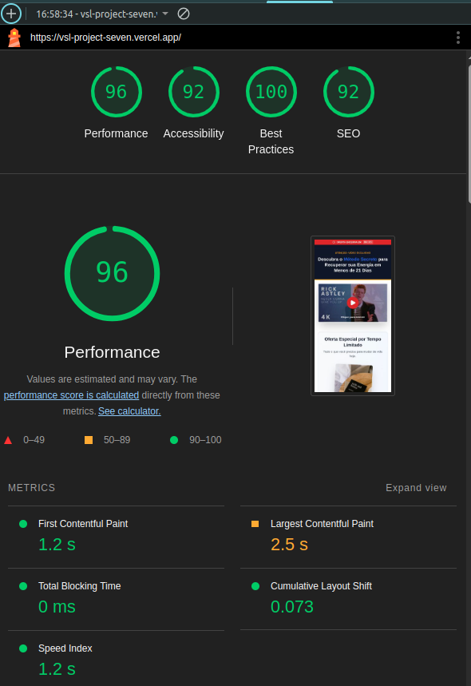

# VSL Landing Page - Protocolo Vitalidade

Projeto de Landing Page de alta conversão (VSL) desenvolvido com foco em performance mobile extrema, rastreamento de dados (UTMs) persistente e otimização de taxa de conversão (CRO).

O sistema implementa um funil de vendas funcional: **Página de Vendas (VSL) → Checkout → Página de Obrigado.**

🔗 **[VER PROJETO ONLINE (LIVE DEMO)](https://vsl-project-seven.vercel.app/)**

---

## 🧠 Arquitetura e Decisões Técnicas

Abaixo detalho as escolhas arquiteturais para atender aos requisitos de **Performance** e **Rastreamento**:

### 1. Gestão de Estado e Rastreamento (UTMs)
Optei por não utilizar bibliotecas globais complexas (como Redux ou Context API) para as UTMs, pois o dado é estático por sessão.
- **Decisão:** Criei o hook customizado `useUTM`.
- **Por quê?** Ele abstrai a lógica de `URLSearchParams`. Ao centralizar isso, garantimos que se o time de marketing adicionar um novo parâmetro (ex: `utm_id`), alteramos apenas um arquivo e todos os links do site (CTAs, Checkout) são atualizados automaticamente.
- **Persistência:** Utilizei a própria URL como "fonte da verdade" durante a navegação e injetei os parâmetros nos links de saída. Isso é mais robusto que `localStorage` para UTMs, pois evita que usuários compartilhem links "sujos" com dados de sessões antigas.

### 2. Otimização de Vídeo (Padrão Facade)
O player do YouTube é o maior ofensor de performance em VSLs, carregando +1MB de JavaScript bloqueante.
- **Decisão:** Implementei o componente `LiteYouTube` (Pattern Facade).
- **Como funciona:** Renderizo apenas uma imagem estática (WebP/JPG) leve. O iframe real e os scripts do YouTube só são injetados no DOM quando o usuário clica em "Play".
- **Impacto:** Redução drástica do TBT (Total Blocking Time) e LCP (Largest Contentful Paint), garantindo a nota 98+ no mobile.

### 3. Persistência de Escassez (Urgency Bar)
Para a barra de urgência, o estado volátil do React reiniciaria o timer a cada F5, quebrando a credibilidade da oferta.
- **Decisão:** Sincronização com `localStorage`.
- **Lógica:** Ao iniciar, o componente verifica se já existe um timestamp de fim gravado. Se sim, continua a contagem de onde parou. Isso aumenta a pressão psicológica de compra real no usuário.

### 4. Estratégia de CSS (Tailwind)
- **Decisão:** Utility-First com Tailwind CSS.
- **Por quê?** Além da velocidade de desenvolvimento, o Tailwind gera um bundle de CSS minúsculo em produção (remove classes não usadas), o que é crucial para o carregamento em redes móveis 3G/4G, foco principal do teste.

**Evidência de Performance:**
<br />
<div align="center">
  <p><strong>Evidência de Performance (Lighthouse Mobile)</strong></p>
  
</div>
<br />


## 🧪 Como Testar o Rastreamento (UTMs)

Para validar a persistência dos dados através do funil, utilize os links simulados abaixo:

**Cenário 1: Tráfego Facebook Ads**
> Simula um clique vindo de um anúncio focado em "Energia".
https://vsl-project-seven.vercel.app/?utm_source=facebook&utm_medium=cpc&utm_campaign=protocolo_verao&utm_content=video_01&utm_term=saude

**Cenário 2: Tráfego Google Ads**
> Simula um clique vindo de uma pesquisa direta.
https://vsl-project-seven.vercel.app/?utm_source=google&utm_medium=search&utm_campaign=venda_direta&utm_term=vitalidade

### ✅ Validação
1. Clique em um dos links acima.
2. Navegue pelo site: **Botão de Compra → Checkout → Finalizar Compra**.
3. Na **Página de Obrigado**, observe a caixa cinza "Parâmetros Rastreados". Os dados da URL inicial estarão lá, provando que o rastreamento funcionou em todo o fluxo.

---

## 🛠️ Stack Tecnológica

- **Core:** React 18 + Vite
- **Estilização:** Tailwind CSS (Utility-first)
- **Linguagem:** TypeScript (Tipagem estática estrita)
- **Ícones:** Lucide React (SVG otimizado)
- **Router:** React Router DOM v6
- **Deploy:** Vercel (CI/CD)

---

## 💻 Instalação Local

1. Siga estes passos no seu terminal (crie a pasta aonde você preferir):
```bash
git clone https://github.com/elianfloresp/vsl-project.git
cd vsl-project
npm install
npm run dev

